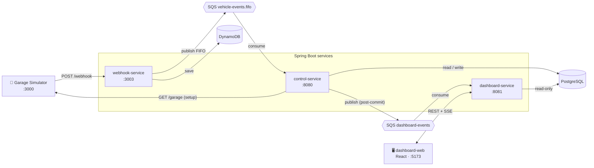
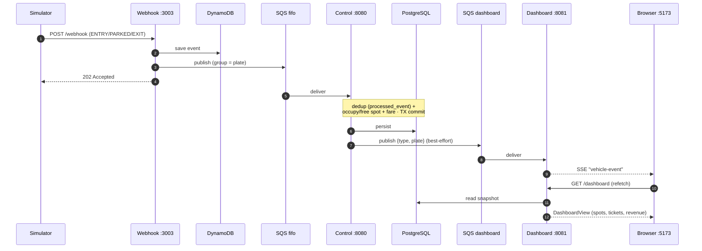
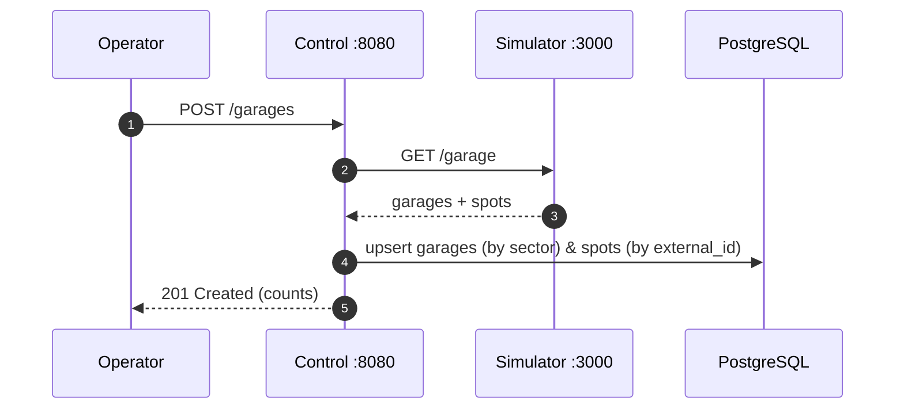
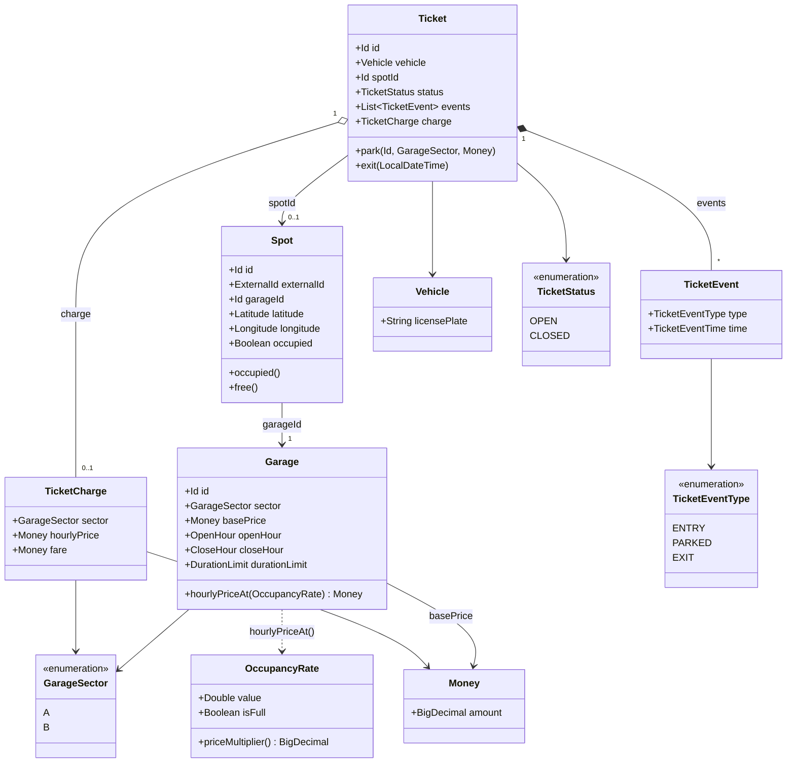
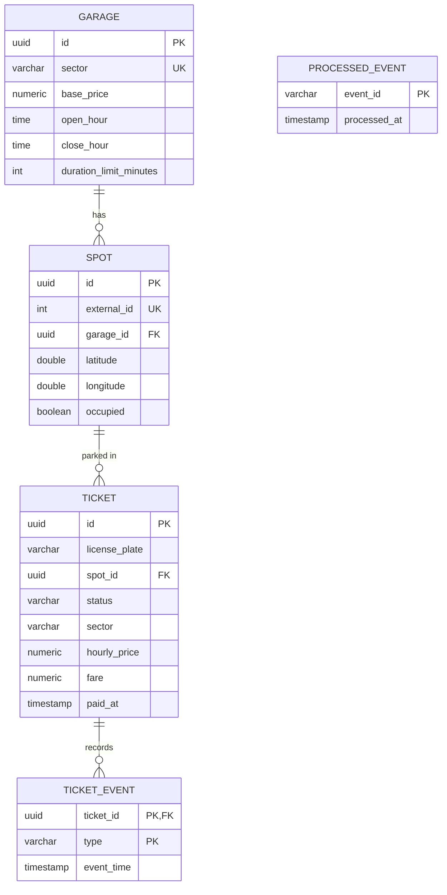

# 🅿️ Garage Service

> **EN** — Event-driven parking-garage backend (Estapar Backend Developer Test) plus a real-time
> dashboard. Built as a Gradle multi-module project with **Kotlin + Spring Boot 4**, **hexagonal
> architecture**, **SQS/DynamoDB (LocalStack)**, **PostgreSQL/Flyway** and a **React + Tailwind** UI.
>
> **PT** — Backend de estacionamento orientado a eventos (Teste Estapar de Backend) com um dashboard
> em tempo real. Projeto Gradle multi-módulo em **Kotlin + Spring Boot 4**, **arquitetura hexagonal**,
> **SQS/DynamoDB (LocalStack)**, **PostgreSQL/Flyway** e uma UI em **React + Tailwind**.

---

## 📑 Índice / Table of Contents

1. [Overview / Visão geral](#-overview--visão-geral)
2. [Architecture / Arquitetura](#-architecture--arquitetura)
3. [Modules / Módulos](#-modules--módulos)
4. [Tech stack](#-tech-stack)
5. [Project structure / Estrutura do projeto](#-project-structure--estrutura-do-projeto)
6. [Sequence diagrams / Diagramas de sequência](#-sequence-diagrams--diagramas-de-sequência)
7. [Domain class diagram / Diagrama de classes](#-domain-class-diagram--diagrama-de-classes)
8. [Database (ER) / Banco de dados (MER)](#-database-er--banco-de-dados-mer)
9. [Business rules / Regras de negócio](#-business-rules--regras-de-negócio)
10. [API endpoints](#-api-endpoints)
11. [Real-time dashboard / Dashboard em tempo real](#-real-time-dashboard--dashboard-em-tempo-real)
12. [Running locally / Como rodar](#-running-locally--como-rodar)
13. [Configuration / Configuração](#-configuration--configuração)
14. [Tests & coverage / Testes e cobertura](#-tests--coverage--testes-e-cobertura)

---

## 🌐 Overview / Visão geral

**EN** — A garage **simulator** emits vehicle events (`ENTRY` → `PARKED` → `EXIT`) to a webhook.
The webhook persists each event and pushes it onto a **FIFO queue**. The **control service** consumes
that queue, applies the business rules (occupy/free spots, dynamic pricing, fare calculation) and
stores everything in PostgreSQL. After committing, it forwards a lightweight event to a second queue
that the **dashboard service** streams to the browser over **SSE**, giving a live view of spots and
tickets.

**PT** — Um **simulador** de garagem emite eventos de veículos (`ENTRY` → `PARKED` → `EXIT`) para um
webhook. O webhook persiste cada evento e o publica numa **fila FIFO**. O **control service** consome
essa fila, aplica as regras de negócio (ocupar/liberar vagas, preço dinâmico, cálculo de tarifa) e
grava tudo no PostgreSQL. Após o commit, ele encaminha um evento enxuto para uma segunda fila que o
**dashboard service** transmite ao navegador via **SSE**, dando uma visão ao vivo de vagas e tickets.

---

## 🏛 Architecture / Arquitetura



**EN** — Each service is independent: the **control service owns the database schema** (Flyway), the
**dashboard service reads it read-only**, and the **webhook service** only touches DynamoDB + SQS.
Services are decoupled through queues — the control service publishes to a queue, it does not call the
dashboard directly.

**PT** — Cada serviço é independente: o **control service é dono do schema do banco** (Flyway), o
**dashboard service apenas lê** (read-only) e o **webhook service** só fala com DynamoDB + SQS. Os
serviços são desacoplados por filas — o control service publica numa fila, não chama o dashboard
diretamente.

---

## 🧩 Modules / Módulos

| Module | Port | Responsibility (EN) | Responsabilidade (PT) |
|---|---|---|---|
| `garage-control-webhook-service` | `3003` | Receives `POST /webhook`, saves to DynamoDB, publishes to the FIFO queue | Recebe `POST /webhook`, grava no DynamoDB, publica na fila FIFO |
| `garage-control-service` | `8080` | Core domain: processes events, pricing/fare, owns Postgres, `GET /revenue` | Domínio central: processa eventos, preço/tarifa, dono do Postgres, `GET /revenue` |
| `garage-control-dashboard-service` | `8081` | Read model + SSE: `GET /dashboard`, `GET /dashboard/stream` | Read model + SSE: `GET /dashboard`, `GET /dashboard/stream` |
| `garage-dashboard-web` | `5173` | React + Tailwind real-time dashboard | Dashboard em tempo real em React + Tailwind |

---

## 🛠 Tech stack

- **Language / Linguagem:** Kotlin 2.3.21 (Java 25 toolchain)
- **Framework:** Spring Boot 4.1.0 (Web MVC, Data JPA, RestClient, Flyway)
- **Build:** Gradle (Kotlin DSL), multi-module
- **Database / Banco:** PostgreSQL 16 + Flyway migrations; DynamoDB (webhook)
- **Messaging / Mensageria:** AWS SQS via `spring-cloud-aws` 4.0.2 (FIFO + standard), LocalStack
- **Frontend:** React 19, TypeScript, Vite 6, Tailwind CSS v4
- **Quality / Qualidade:** MockK + JUnit 5, Kover (gate **90%**), SonarQube
- **Infra (dev):** Docker Compose (Postgres, simulator, LocalStack, admin UIs, SonarQube)

---

## 📁 Project structure / Estrutura do projeto

```text
garage-service/
├─ build.gradle.kts                # plugins + aggregated SonarQube config
├─ settings.gradle.kts             # includes the 3 backend modules
├─ docker-compose.yml              # postgres, simulator, localstack, admin UIs, sonarqube
├─ localstack/init/                # creates SQS queues + DynamoDB table on startup
│
├─ garage-control-service/         # ── CORE (hexagonal) · :8080
│  └─ src/main/kotlin/.../garageservice/
│     ├─ domain/                   # framework-free: aggregates + value objects + exceptions
│     │  ├─ garage/  spot/  ticket/        (+ valueobject/ in each)
│     │  └─ exception/             # sealed BaseException hierarchy
│     ├─ application/              # use cases + ports (repository/gateway interfaces)
│     │  ├─ garage/  spot/  ticket/
│     └─ infra/                    # adapters
│        ├─ input/rest/            # controllers + @RestControllerAdvice
│        ├─ input/messaging/       # @SqsListener consumer
│        └─ output/                # JPA repositories, RestClient gateway, SQS publisher
│     └─ src/main/resources/db/migration/   # Flyway V1..V4
│
├─ garage-control-webhook-service/ # ── WEBHOOK · :3003 (DynamoDB + SQS publisher)
│
├─ garage-control-dashboard-service/ # ── READ MODEL + SSE · :8081
│  └─ src/main/kotlin/.../dashboard/
│     ├─ api/ (DashboardController) + api/stream/ (SSE broadcaster)
│     ├─ messaging/ (DashboardEventConsumer)
│     ├─ persistence/ (read-only JPA entities)
│     └─ query/ (DashboardQueryService)
│
└─ garage-dashboard-web/           # ── FRONTEND · :5173 (React + Vite + Tailwind)
   └─ src/ (App.tsx, api.ts, components/)
```

**EN** — `garage-control-service` follows **hexagonal architecture**: `domain` has **no framework
dependency**, `application` holds use cases and ports, and `infra` holds the adapters (REST,
messaging, persistence).

**PT** — O `garage-control-service` segue **arquitetura hexagonal**: o `domain` **não depende de
framework**, o `application` tem os casos de uso e as portas, e o `infra` tem os adaptadores (REST,
mensageria, persistência).

---

## 🔁 Sequence diagrams / Diagramas de sequência

### 1. Vehicle event lifecycle / Ciclo de vida do evento



### 2. Garage setup / Carga das garagens



---

## 🧱 Domain class diagram / Diagrama de classes



**EN** — Value objects (`Id`, `Money`, `Latitude`, `OccupancyRate`, …) validate their own invariants
and throw a sealed `BaseException` subtype (`GarageException`, `SpotException`, `MoneyException`,
`TicketException`, `GarageApiException`), which the REST advice maps to HTTP status codes.

**PT** — Os value objects (`Id`, `Money`, `Latitude`, `OccupancyRate`, …) validam seus próprios
invariantes e lançam um subtipo selado de `BaseException` (`GarageException`, `SpotException`,
`MoneyException`, `TicketException`, `GarageApiException`), que o advice REST mapeia para status HTTP.

---

## 🗄 Database (ER) / Banco de dados (MER)



**EN** — `(latitude, longitude)` is unique on `SPOT` (lookup by coordinates on `PARKED`).
`TICKET.sector`/`hourly_price` are a **pricing snapshot** captured at `PARKED`; `fare`/`paid_at` are
the **settlement** captured at `EXIT`. `PROCESSED_EVENT` is an **inbox table** for idempotency.
The webhook service additionally writes to a DynamoDB table `webhook_events` (PK `id`).

**PT** — `(latitude, longitude)` é único em `SPOT` (busca por coordenadas no `PARKED`).
`TICKET.sector`/`hourly_price` são um **snapshot de preço** capturado no `PARKED`; `fare`/`paid_at`
são a **liquidação** capturada no `EXIT`. `PROCESSED_EVENT` é uma **tabela inbox** para idempotência.
O webhook service ainda grava numa tabela DynamoDB `webhook_events` (PK `id`).

---

## 💸 Business rules / Regras de negócio

**EN**
- **ENTRY** → opens an `OPEN` ticket for the plate — unless the garage is **full** (100% overall
  occupancy), in which case it is skipped silently (no ticket).
- **PARKED** → finds the spot by `(lat, lng)`, marks it occupied, and **snapshots** the price:
  `hourlyPrice = basePrice × dynamicMultiplier`, then attaches it to the open ticket.
- **EXIT** → frees the spot, computes the **fare** and closes the ticket.
- **Dynamic pricing** (by **overall** occupancy at park time):
  `< 25% → −10%` · `≤ 50% → base` · `≤ 75% → +10%` · `≤ 100% → +25%`.
- **Fare** = first `FREE_MINUTES` free (constant in `Ticket`, default **30 min**), then **every
  started hour rounded up** × snapshot hourly price. No spot taken → no charge.
- **Idempotency**: each event id is registered in `processed_event` inside the same transaction; a
  redelivered duplicate is skipped. FIFO ordering keeps a plate's events in sequence.
- **Orphan events** (PARKED/EXIT with no open ticket) are **skipped silently** (a thrown error would
  block the FIFO message group forever).

**PT**
- **ENTRY** → abre um ticket `OPEN` para a placa — exceto se a garagem estiver **cheia** (100% de
  ocupação geral), quando é ignorado em silêncio (sem ticket).
- **PARKED** → encontra a vaga por `(lat, lng)`, marca como ocupada e **congela** o preço:
  `hourlyPrice = basePrice × multiplicadorDinâmico`, anexando ao ticket aberto.
- **EXIT** → libera a vaga, calcula a **tarifa** e fecha o ticket.
- **Preço dinâmico** (pela ocupação **geral** no momento do parking):
  `< 25% → −10%` · `≤ 50% → base` · `≤ 75% → +10%` · `≤ 100% → +25%`.
- **Tarifa** = primeiros `FREE_MINUTES` grátis (constante em `Ticket`, padrão **30 min**), depois
  **cada hora iniciada, arredondando pra cima** × preço/hora do snapshot. Sem vaga ocupada → sem
  cobrança.
- **Idempotência**: cada id de evento é registrado em `processed_event` na mesma transação; uma
  reentrega duplicada é ignorada. A ordem FIFO mantém os eventos da placa em sequência.
- **Eventos órfãos** (PARKED/EXIT sem ticket aberto) são **ignorados em silêncio** (lançar erro
  travaria o grupo de mensagens FIFO para sempre).

---

## 🔌 API endpoints

| Service | Method & path | Description (EN) | Descrição (PT) |
|---|---|---|---|
| webhook `:3003` | `POST /webhook` | Receive a vehicle event (→ 202) | Recebe um evento de veículo (→ 202) |
| control `:8080` | `POST /garages` | Load garages/spots from the simulator (→ 201) | Carrega garagens/vagas do simulador (→ 201) |
| control `:8080` | `GET /revenue?date=YYYY-MM-DD&sector=A` | Revenue for a sector/day (→ 200) | Faturamento por setor/dia (→ 200) |
| dashboard `:8081` | `GET /dashboard` | Snapshot: summary + spots + recent tickets | Snapshot: resumo + vagas + tickets recentes |
| dashboard `:8081` | `GET /dashboard/stream` | SSE stream of `vehicle-event` | Stream SSE de `vehicle-event` |

---

## 📊 Real-time dashboard / Dashboard em tempo real

**EN** — Two channels work together: **state** and **live**.
- **State (snapshot)**: the browser calls `GET /dashboard`, which reads the shared database — the
  source of truth (occupancy, revenue per sector, spots, tickets with their event timeline).
- **Live (push)**: after each commit the control service publishes to `dashboard-events`; the
  dashboard service consumes it and fans it out via **SSE**. On every event the browser appends to
  the activity feed and re-fetches the snapshot (debounced). A 5s poll is the fallback.

**PT** — Duas trilhas trabalham juntas: **estado** e **tempo real**.
- **Estado (snapshot)**: o navegador chama `GET /dashboard`, que lê o banco compartilhado — a fonte
  da verdade (ocupação, receita por setor, vagas, tickets com a linha do tempo dos eventos).
- **Tempo real (push)**: após cada commit o control service publica em `dashboard-events`; o
  dashboard service consome e faz fan-out via **SSE**. A cada evento o navegador adiciona ao feed e
  rebusca o snapshot (com debounce). Um poll de 5s é o fallback.

---

## ▶️ Running locally / Como rodar

**EN** — Prerequisites: Docker + JDK 25 + Node 20+. From the repo root:

**PT** — Pré-requisitos: Docker + JDK 25 + Node 20+. Na raiz do projeto:

```bash
# 1. Infra: Postgres, simulator, LocalStack (SQS + DynamoDB), admin UIs, SonarQube
docker compose up -d

# 2. Backend services (each in its own terminal) / serviços de backend (cada um num terminal)
./gradlew :garage-control-service:bootRun            # :8080
./gradlew :garage-control-webhook-service:bootRun    # :3003
./gradlew :garage-control-dashboard-service:bootRun  # :8081

# 3. Seed garages & spots from the simulator / Carrega garagens e vagas do simulador
curl -X POST http://localhost:8080/garages

# 4. Frontend
cd garage-dashboard-web && npm install && npm run dev # :5173
```

**EN** — Open the dashboard at **http://localhost:5173**. The simulator starts sending webhook events
automatically once the webhook service is up; after the `POST /garages` seed, spots and tickets light
up live.

**PT** — Abra o dashboard em **http://localhost:5173**. O simulador começa a enviar eventos
automaticamente assim que o webhook sobe; após o `POST /garages`, vagas e tickets aparecem ao vivo.

### Helper ports / Portas auxiliares

| URL | What / O quê |
|---|---|
| http://localhost:3000 | Garage simulator |
| http://localhost:8001 | DynamoDB Admin |
| http://localhost:3999 | SQS Admin |
| http://localhost:9000 | SonarQube |

---

## ⚙️ Configuration / Configuração

**EN** — Sensible localhost defaults; override via environment variables.
**PT** — Defaults para localhost; sobrescreva via variáveis de ambiente.

| Variable | Default | Used by |
|---|---|---|
| `SPRING_DATASOURCE_URL` | `jdbc:postgresql://localhost:5432/garage` | control, dashboard |
| `AWS_ENDPOINT` | `http://localhost:4566` | all (LocalStack) |
| `GARAGE_API_BASE_URL` | `http://localhost:3000` | control (simulator) |
| `VEHICLE_EVENTS_QUEUE` | `vehicle-events.fifo` | webhook, control |
| `DASHBOARD_EVENTS_QUEUE` | `dashboard-events` | control, dashboard |
| `VITE_API_BASE_URL` | `http://localhost:8081` | frontend |

---

## ✅ Tests & coverage / Testes e cobertura

```bash
./gradlew test          # unit + context tests (all modules)
./gradlew koverVerify   # coverage gate (90% line coverage per module)
./gradlew sonar         # SonarQube analysis (requires SONAR_HOST_URL / token)
```

**EN** — Unit tests use **MockK + JUnit 5**; each backend module enforces a **90%** line-coverage
gate with **Kover**, and coverage is aggregated into **SonarQube**. Pure DTOs, persistence entities
and framework wiring are excluded from the gate.

**PT** — Os testes unitários usam **MockK + JUnit 5**; cada módulo de backend exige **90%** de
cobertura de linha com **Kover**, e a cobertura é agregada no **SonarQube**. DTOs puros, entidades de
persistência e wiring de framework ficam fora do gate.

---

<sub>Estapar Backend Developer Test · Kotlin · Spring Boot 4 · Hexagonal · Event-driven</sub>
